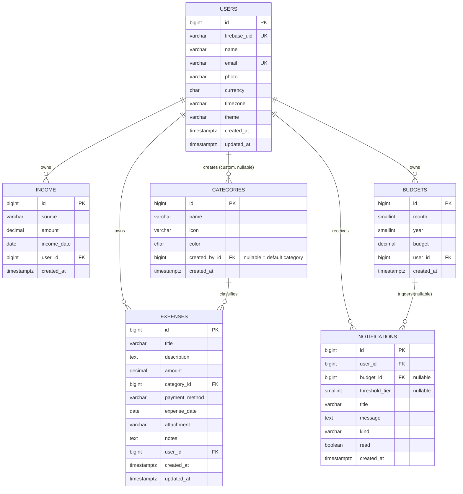

# Expense Tracker Enterprise — Database Design

Status: Draft v1.0
Companion docs: [HLD.md](./HLD.md) · [LLD.md](./LLD.md)

This document formalizes the data layer that sits under the Repository layer defined in the LLD. It does not change the entity list or ownership model already agreed there — it normalizes, types, constrains, and indexes it for production use.

## Executive Summary

A single relational schema (PostgreSQL in production, SQLite in dev via the same Django ORM) covering six tables: `users`, `categories`, `expenses`, `income`, `budgets`, `notifications`. The schema is in 3NF with no denormalization. The design centers on two things the LLD's repository contracts require: (1) fast filtered/sorted/searched reads on `expenses` — the hottest table — and (2) an idempotency guarantee for budget-threshold notifications under concurrent writes, closing a real race condition in the Observer flow described in the LLD.

## Database Recommendation

**PostgreSQL (prod) / SQLite (dev), via Django ORM — confirmed, not reconsidered.** This is a textbook relational domain: fixed entities, strong FK relationships (every expense/income/budget belongs to exactly one user), transactional integrity matters (a budget-threshold check must see committed expense writes), and every access pattern in the LLD is a SQL-shaped query (filter, aggregate, sort, paginate). Nothing here calls for NoSQL, a graph DB, or a vector store — reaching for one would be unjustified complexity for this domain and scale.

## Assumptions

1. Personal-finance scale: hundreds to low-thousands of users initially, each with hundreds to low-thousands of expense rows/year — not millions of rows per user. This rules out partitioning/sharding as a v1 concern (see Scalability Plan).
2. `expense_date`/`income_date` are user-local calendar dates (not timestamps) — a user logs "I spent this on Aug 3," not a precise instant.
3. Receipts (`attachment`) are stored as a path/URL to file storage (local `media/` in dev, object storage in prod), not as DB blobs — matches HLD's media-storage component.
4. Currency is single-currency-per-user (`User.currency`), not multi-currency ledger per expense — matches the doc's Profile module (`currency` is a user setting, not a per-transaction field).

## Requirements Summary (data-relevant subset)

Full CRUD on Expense/Income/Budget/Category/Notification, scoped per-user; search + multi-filter + sort + pagination on Expense; period aggregation (sum, sum-by-category) for Income and Expense; one Budget per user per month; budget-threshold alerts at 80/90/100%; default vs. user-custom categories.

---

## Entity Model & Relationships

- `User` 1 — * `Expense`, `Income`, `Budget`, `Notification`, `Category` (custom only)
- `Category` 1 — * `Expense`
- `Budget` 1 — * `Notification` (a threshold alert references the budget it was raised against)

All ownership FKs (`Expense.user`, `Income.user`, `Budget.user`, `Notification.user`, `Category.created_by`) cascade on user deletion — deleting a `User` removes all their data, a reasonable default for a personal-data app (right-to-erasure-friendly). `Expense.category` uses `RESTRICT`/`PROTECT`, not cascade — see Constraints.

## ER Diagram



---

## Table Design (PostgreSQL DDL)

### `users`

```sql
CREATE TABLE users (
    id              BIGSERIAL PRIMARY KEY,
    firebase_uid    VARCHAR(128) NOT NULL UNIQUE,
    name            VARCHAR(150) NOT NULL,
    email           VARCHAR(254) NOT NULL UNIQUE,
    photo           VARCHAR(500),
    currency        CHAR(3) NOT NULL DEFAULT 'INR',
    timezone        VARCHAR(50) NOT NULL DEFAULT 'Asia/Kolkata',
    theme           VARCHAR(10) NOT NULL DEFAULT 'light'
                        CHECK (theme IN ('light', 'dark')),
    created_at      TIMESTAMPTZ NOT NULL DEFAULT now(),
    updated_at      TIMESTAMPTZ NOT NULL DEFAULT now()
);
```

`firebase_uid` is looked up on **every authenticated request** (`FirebaseAuthentication.authenticate` in the LLD) — its `UNIQUE` constraint doubles as the required index, so no separate index is added.

### `categories`

```sql
CREATE TABLE categories (
    id              BIGSERIAL PRIMARY KEY,
    name            VARCHAR(100) NOT NULL,
    icon            VARCHAR(50) NOT NULL,
    color           CHAR(7) NOT NULL CHECK (color ~ '^#[0-9A-Fa-f]{6}$'),
    created_by_id   BIGINT REFERENCES users(id) ON DELETE CASCADE,
    created_at      TIMESTAMPTZ NOT NULL DEFAULT now(),
    CONSTRAINT uq_category_owner_name UNIQUE (created_by_id, name)
);

-- Standard UNIQUE(created_by_id, name) does NOT dedupe rows where
-- created_by_id IS NULL (SQL treats every NULL as distinct), which would let
-- two "default" categories share a name. A partial unique index closes that gap:
CREATE UNIQUE INDEX uq_category_default_name
    ON categories (name) WHERE created_by_id IS NULL;

CREATE INDEX idx_category_created_by ON categories (created_by_id);
```

Supported on both target databases: PostgreSQL and SQLite (3.8+) both support partial/conditional unique indexes, and Django exposes this as `UniqueConstraint(fields=[...], condition=Q(...))` — no dev/prod divergence in behavior.

### `expenses` (hottest table — see Index Strategy)

```sql
CREATE TABLE expenses (
    id              BIGSERIAL PRIMARY KEY,
    title           VARCHAR(200) NOT NULL,
    description     TEXT,
    amount          DECIMAL(12,2) NOT NULL CHECK (amount > 0),
    category_id     BIGINT NOT NULL REFERENCES categories(id) ON DELETE RESTRICT,
    payment_method  VARCHAR(20) NOT NULL
                        CHECK (payment_method IN ('cash','card','upi','net_banking','other')),
    expense_date    DATE NOT NULL,
    attachment      VARCHAR(500),
    notes           TEXT,
    user_id         BIGINT NOT NULL REFERENCES users(id) ON DELETE CASCADE,
    created_at      TIMESTAMPTZ NOT NULL DEFAULT now(),
    updated_at      TIMESTAMPTZ NOT NULL DEFAULT now()
);
```

`category_id` uses `ON DELETE RESTRICT` (Django `PROTECT`), not `CASCADE`: deleting a category that still classifies expenses must fail loudly rather than silently orphan/delete financial history. The `categories` service (LLD) already forbids deleting default categories; this adds the same guarantee at the DB level for custom categories with existing expenses, and is the correct place for it — application checks can be bypassed by a bug, the constraint cannot.

### `income`

```sql
CREATE TABLE income (
    id              BIGSERIAL PRIMARY KEY,
    source          VARCHAR(20) NOT NULL
                        CHECK (source IN ('salary','freelancing','investment','bonus','other')),
    amount          DECIMAL(12,2) NOT NULL CHECK (amount > 0),
    income_date     DATE NOT NULL,
    user_id         BIGINT NOT NULL REFERENCES users(id) ON DELETE CASCADE,
    created_at      TIMESTAMPTZ NOT NULL DEFAULT now()
);
```

### `budgets`

```sql
CREATE TABLE budgets (
    id              BIGSERIAL PRIMARY KEY,
    month           SMALLINT NOT NULL CHECK (month BETWEEN 1 AND 12),
    year            SMALLINT NOT NULL CHECK (year BETWEEN 2000 AND 2100),
    budget          DECIMAL(12,2) NOT NULL CHECK (budget > 0),
    user_id         BIGINT NOT NULL REFERENCES users(id) ON DELETE CASCADE,
    created_at      TIMESTAMPTZ NOT NULL DEFAULT now(),
    CONSTRAINT uq_budget_user_period UNIQUE (user_id, month, year)
);
```

The uniqueness constraint doubles as the index `BudgetRepository.get_for_period` needs — no separate index required.

### `notifications`

```sql
CREATE TABLE notifications (
    id              BIGSERIAL PRIMARY KEY,
    user_id         BIGINT NOT NULL REFERENCES users(id) ON DELETE CASCADE,
    budget_id       BIGINT REFERENCES budgets(id) ON DELETE CASCADE,
    threshold_tier  SMALLINT CHECK (threshold_tier IN (80, 90, 100)),
    title           VARCHAR(200) NOT NULL,
    message         TEXT NOT NULL,
    kind            VARCHAR(30) NOT NULL
                        CHECK (kind IN ('budget_exceeded','budget_reminder','daily_reminder')),
    read            BOOLEAN NOT NULL DEFAULT FALSE,
    created_at      TIMESTAMPTZ NOT NULL DEFAULT now(),
    CONSTRAINT uq_budget_threshold_once
        UNIQUE (budget_id, threshold_tier)
);
```

`budget_id` + `threshold_tier` are new versus the doc's original field list — added specifically to close the concurrency race described below. `daily_reminder`/generic notifications simply leave both NULL (the unique constraint only applies where `budget_id IS NOT NULL`, which Postgres/SQLite both honor automatically since NULLs never conflict under a UNIQUE constraint).

---

## Constraints Summary

| Table | Constraint | Purpose |
|---|---|---|
| users | `UNIQUE(firebase_uid)`, `UNIQUE(email)` | One local record per Firebase identity; no duplicate accounts |
| categories | `UNIQUE(created_by_id, name)` + partial `UNIQUE(name) WHERE created_by_id IS NULL` | No duplicate category name per owner, and no duplicate default names |
| expenses, income, budgets | `CHECK (amount > 0)` / `CHECK (budget > 0)` | Money fields can never be zero/negative at the DB level, regardless of app-layer bugs |
| expenses | `CHECK (payment_method IN (...))` | Mirrors the Django `TextChoices` enum so invalid values can't enter via a raw connection or a future non-Django client |
| budgets | `UNIQUE(user_id, month, year)` | One budget per user per period — matches the doc's model exactly |
| notifications | `UNIQUE(budget_id, threshold_tier)` | Idempotency: a given budget can only ever raise one 80%, one 90%, one 100% alert (see Transaction Strategy) |
| expenses.category_id | `ON DELETE RESTRICT` | Prevents silent loss of category context on historical expenses |
| all `user_id`/`created_by_id` FKs | `ON DELETE CASCADE` | Deleting a user removes their data — the right default for personal financial data |

## Keys

Surrogate `BIGSERIAL`/`BigAutoField` primary keys throughout (Django's default) — no natural key is a good PK candidate here (`firebase_uid` is a good *unique* key but external-system identifiers make poor PKs since they're outside this system's control). No UUIDs: nothing here is exposed as a public/guessable resource ID that would benefit from UUID's non-enumerability, and sequential bigints are cheaper to index and join.

---

## Index Strategy

Every index below is justified against a specific access pattern from the LLD's repository contracts — no speculative indexing.

| Index | Table | Supports |
|---|---|---|
| `(user_id, expense_date DESC)` | expenses | Default `ExpenseFilter` ordering (`-expense_date`) and `date_from`/`date_to` range filtering — the single most common query shape (`list_filtered`, `sum_for_period`) |
| `(user_id, category_id)` | expenses | Category filter + `sum_by_category` grouping |
| `(user_id, payment_method)` | expenses | Payment-method filter |
| GIN/trigram on `title`, `description` (Postgres, via `pg_trgm`) | expenses | Free-text `search` across title/description using `ILIKE '%term%'` — trigram indexing fits short, partial-match expense titles better than full-text stemming |
| `(user_id, income_date)` | income | `sum_for_period` |
| `(created_by_id, name)` *(from the unique constraint)* | categories | `list_for_user` (custom half of the UNION) |
| `(name) WHERE created_by_id IS NULL` *(from the partial unique index)* | categories | `list_for_user` (default half of the UNION) |
| `(user_id, read, created_at DESC)` | notifications | Dashboard's "upcoming budget alerts" / unread-notifications panel |

**Explicitly not indexed (yet):** `amount` range filtering (`amount_min`/`amount_max`). It's a supported filter, but date-range and category are the dominant real-world filters for an expense list; add a `(user_id, amount)` index later only if usage data shows it's actually hit hard — every index has a write-cost on every `INSERT`/`UPDATE`, and `expenses` is the highest-write table in the schema.

**Dev/prod portability note:** `pg_trgm` is PostgreSQL-only. In SQLite (dev), the search filter falls back to an unindexed `LIKE` scan — acceptable given dev datasets are small; Django can conditionally apply the trigram index only under `connection.vendor == 'postgresql'` in the migration.

---

## Transaction Strategy — Budget Threshold Race Condition

**The race:** the LLD's `BudgetService._notify_if_threshold_crossed` recomputes `spent = SUM(expenses.amount)` after every expense write and compares it to the budget. If two expenses for the same user/month are created concurrently (two requests, two DB connections), both transactions can read the pre-insert `spent` total, both independently conclude "threshold not yet crossed" (or both independently conclude it *was* just crossed), and either miss the alert or fire it twice.

**Mitigation (two layers, defense in depth):**

1. **Pessimistic lock during evaluation.** Wrap `ExpenseService.create_expense`'s insert + `BudgetService` threshold evaluation in one DB transaction, taking `SELECT ... FOR UPDATE` on the relevant `Budget` row (Django: `Budget.objects.select_for_update().get(...)` inside `transaction.atomic()`). This serializes threshold evaluation per user-per-month — the second concurrent transaction blocks until the first commits, so it always sees the first expense's committed sum. Contention is negligible: locking is scoped to one user's one budget row, never global.
2. **DB-level idempotency backstop.** Even if evaluation logic ever races despite the lock (e.g. a future code path that evaluates outside the lock), the `UNIQUE(budget_id, threshold_tier)` constraint on `notifications` makes a duplicate alert for the same tier physically impossible to insert — the second `INSERT` fails, and `NotificationService` should catch that as "already notified, no-op" rather than an error.

This is the correct split of responsibility: the lock prevents the race from mattering in the common case; the constraint guarantees correctness even if application logic has a bug — matching the skill's principle of enforcing integrity at the DB level, not trusting the app layer alone.

No cross-table distributed transaction is needed — `expenses` and `budgets`/`notifications` live in the same database, so a single Postgres/SQLite ACID transaction covers the whole flow.

---

## Scalability Plan

Current assumed scale (hundreds–low-thousands of users, low-thousands of expense rows/user/year) needs none of: partitioning, sharding, or read replicas — a single Postgres instance with the indexes above comfortably serves this. If `expenses` ever grows to tens of millions of rows across users, time-range partitioning on `expense_date` (e.g. yearly partitions) is the natural next step, since every hot query already filters by a date range — but this is explicitly a future step, not a v1 design decision, per the HLD's evolution roadmap.

## Security Considerations

- PII lives in `users` (`email`, `name`, `photo`) and transitively in `expenses`/`income` (financial behavior is itself sensitive). Encryption at rest/in transit is an infrastructure concern (managed Postgres with TLS + encrypted volumes), not a schema concern, but is called out here since the data warrants it.
- `attachment` (receipts) may contain sensitive financial documents — the storage bucket must be private with access mediated by the app (ownership-checked signed URLs), never a public bucket path. This is an infra/app concern flagged from the schema, not implemented here.
- No column-level masking is warranted at this scale/domain (no SSNs, card numbers, or credentials are stored — Firebase owns credentials entirely, per the HLD).

## Backup & Recovery

Daily automated backups with point-in-time recovery (WAL archiving) via the managed Postgres provider, ~7–30 day retention. An RPO of a few hours and RTO within a business day is appropriate for personal financial *records* (not a payments system processing live transactions) — recommending anything tighter would be over-engineering for the stated scale.

## Data Lifecycle

Hard delete for `Expense`/`Income`/`Budget`/`Category` on user-initiated delete, matching the doc's plain CRUD "Delete Expense" feature — no soft-delete/audit-trail requirement was stated, and adding one would be speculative. User account deletion cascades through all owned data (right-to-erasure-friendly by construction). Deleting an `Expense` with an `attachment` requires an app-layer cleanup step to remove the file from storage (the DB only drops the path reference). `notifications` are a reasonable future candidate for a retention purge (e.g. auto-delete read notifications older than 90 days) — not required for v1.

## Migration & Versioning Approach (Django)

Standard `makemigrations`/`migrate`, one app-scoped migration set per `apps/*` module, applied in FK-dependency order: `accounts` → `categories` → `expenses`/`income`/`budgets` → `notifications`. Default categories (`created_by=NULL` rows: Food, Travel, Bills, Entertainment, Medical, Education, Shopping, Investment, Salary, Other) are seeded via an idempotent Django data migration (`RunPython` using `get_or_create`), not a fixture — keeps seed data versioned alongside the schema change that introduces it.

## Risks

| Risk | Mitigation |
|---|---|
| Budget-threshold duplicate/missed alerts under concurrency | `SELECT FOR UPDATE` + `UNIQUE(budget_id, threshold_tier)` (see Transaction Strategy) |
| `expenses` write cost grows with each added index | Kept to 3 targeted composite indexes + 1 trigram pair; `amount` range explicitly deferred until justified |
| `pg_trgm` unavailable in SQLite dev | Acceptable dev-only degradation to unindexed `LIKE`; conditional migration by `connection.vendor` |
| Orphaned receipt files if `Expense` delete isn't paired with storage cleanup | App-layer responsibility, flagged explicitly rather than assumed handled |

## Trade-offs

- **Chose RESTRICT over CASCADE on `expenses.category_id`:** protects financial history from silent loss at the cost of requiring the app to handle a delete failure gracefully (already the LLD's stated behavior for defaults; now DB-enforced for custom categories too).
- **Chose trigram over full-text search for expense title/description:** better fit for short, partial-match personal-finance text ("starb" matching "Starbucks") than stemmed full-text search, at the cost of being Postgres-specific (acceptable — SQLite is dev-only).
- **Chose pessimistic locking over optimistic concurrency for budget evaluation:** contention is low (per-user, per-month), so the simplicity of a `FOR UPDATE` lock outweighs optimistic concurrency's added retry-logic complexity for this specific, narrow hot spot.

## Recommendations / Next Steps

1. Translate this into Django models (`models.py` per app) + first migration set + the default-category data migration.
2. Enable `pg_trgm` in the production Postgres migration (`CREATE EXTENSION IF NOT EXISTS pg_trgm;`), guarded for SQLite dev.
3. Proceed to the Agile sprint breakdown (already queued) — DB scaffolding is naturally Sprint 1 work alongside the `accounts`/auth module.
