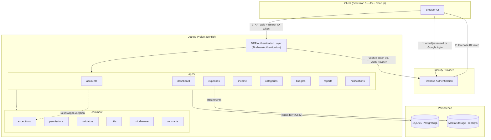
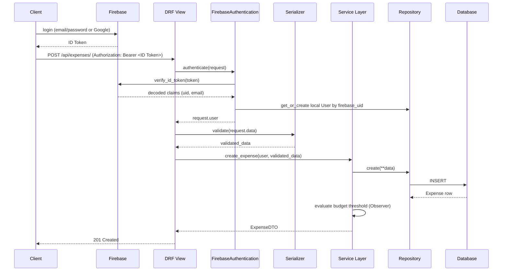
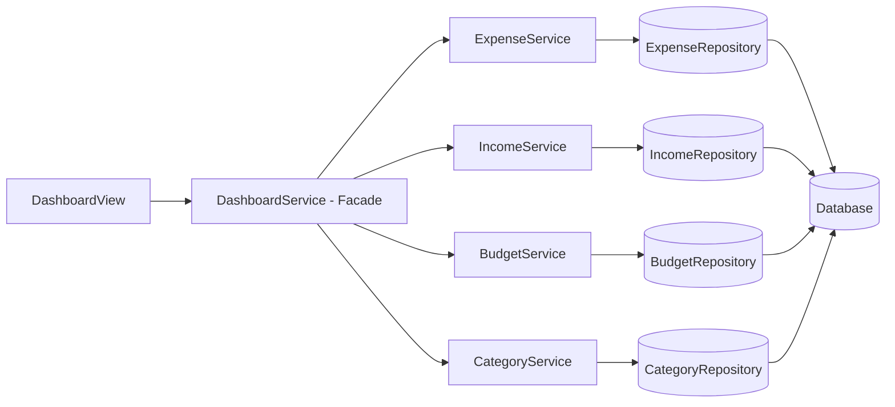

# Expense Tracker Enterprise — High-Level Design (HLD)

Status: Draft v1.0
Owner: Solution Architecture
Companion doc: [LLD.md](./LLD.md)

## Executive Summary

Expense Tracker Enterprise is a Django 5 + DRF backend (Bootstrap/JS/Chart.js frontend) for personal finance tracking: expenses, income, categorized budgets, reports, and analytics, authenticated via Firebase. The recommended architecture is a **Modular Monolith** with a strict **Layered Architecture** inside each module (View → Serializer → Service → Repository → ORM). This gives the project clean bounded contexts and enterprise-grade separation of concerns without the operational cost of microservices, which is unjustified at this scale (single small team, single database, moderate traffic).

## Business Context

- Single-tenant-per-user personal finance app (each user owns their own data; no cross-user sharing/collaboration features in scope).
- Team size: small/solo — favors low operational overhead over distributed-systems complexity.
- Deployment target: Docker-ready, Postgres in production, SQLite in dev — a single deployable unit is sufficient.
- A stated secondary goal is portfolio/interview quality: the architecture should demonstrate enterprise patterns cleanly, which reinforces (not conflicts with) building it correctly.

## Assumptions

1. Traffic is low-to-moderate (personal/small-team tool, not a multi-tenant SaaS at launch) — no need for horizontal-scale-from-day-one design.
2. Firebase Authentication is the permanent identity provider; Django is only ever a token *verifier*, never a password store.
3. Report export (CSV/Excel/PDF) can run synchronously at current scale; async processing is a future evolution step, not a v1 requirement (matches the doc's own "Future Improvements: Celery, Redis").
4. Receipts/attachments are stored on local/media storage in dev, and are expected to move to object storage (S3-compatible) in production — not designed in detail here (infra concern).
5. Single primary database; no polyglot persistence needed at this scale.

## Constraints

- Must follow the specified layering: `Request → View → Serializer → Service Layer → Repository (ORM) → Database`, with business logic kept out of views (user-mandated).
- Must follow the specified folder layout (`config/`, `apps/*`, `common/*`) (user-mandated).
- Must use Firebase Authentication; Django never stores passwords (user-mandated).
- Must support SQLite (dev) and PostgreSQL (prod) via the same ORM layer — repository layer must stay database-agnostic (no raw-SQL lock-in).

## Requirements Summary

**Functional:** Auth (Firebase-backed), Dashboard aggregation, Expense CRUD + search/filter/sort/pagination, Income tracking, Category CRUD (default + custom), Budget tracking with threshold alerts, Reports (daily/weekly/monthly/yearly) with CSV/Excel/PDF export, Notifications (budget exceeded, reminders), Profile management, Admin.

**Non-functional:** Maintainability and clear module boundaries (explicitly requested), testability (service/repository separation enables unit testing without DB or HTTP), security (no password storage, per-user data isolation), observability (structured logging to `logs/application.log`), extensibility (new report formats/notification channels without touching existing code).

---

## Architecture Alternatives Considered

| Option | Fit | Verdict |
|---|---|---|
| **Microservices** (separate services per module) | Wrong scale — introduces network calls, distributed transactions, and deployment complexity for a single-team, single-DB app | Rejected — over-engineering |
| **Fat-model / fat-view Django ("Django default")** | Fast to prototype, but business logic scatters across views/models, hard to unit-test, hard to reuse (e.g. budget-threshold logic needed by both the Expense-create path and a scheduled reminder) | Rejected — doesn't meet the explicit "enterprise / modular / testable" goal |
| **Modular Monolith + Layered architecture per module (recommended)** | Clear bounded contexts (`apps/expenses`, `apps/budgets`, ...), single deployable, business logic isolated in a Service layer that's independently testable, ORM isolated behind Repositories so persistence details don't leak into business rules | **Selected** |
| **Hexagonal/Ports-and-Adapters (full)** | Conceptually similar benefit to the layered approach here, but adds ceremony (explicit port interfaces for every boundary) that isn't justified beyond the Auth and Notification boundaries, where it's applied selectively (see LLD: `AuthProvider`, `NotificationChannel`) | Partially adopted, not globally |

**Recommendation:** Modular Monolith. Each `apps/*` package is a bounded context with its own models, serializers, services, repositories, and URLs; `common/*` holds cross-cutting concerns. This is the pattern real production Django backends use once they outgrow "fat views," and it evolves cleanly toward service extraction later *if* real load ever justifies it (see Evolution Roadmap) — without requiring that decision now.

---

## Recommended Architecture — Component Diagram



**Module boundaries** (each is a Django app under `apps/`, owns its own models/serializers/services/repositories/urls):

| Module | Owns | Depends on |
|---|---|---|
| `accounts` | `User` (mirrors Firebase identity), profile fields | `common` only |
| `categories` | `Category` (default + user-custom) | `accounts` |
| `expenses` | `Expense` | `accounts`, `categories` |
| `income` | `Income` | `accounts` |
| `budgets` | `Budget`, threshold-alert logic | `accounts`, `expenses` (to compute spend) |
| `dashboard` | No models — read-only aggregation façade | `expenses`, `income`, `budgets`, `categories` |
| `reports` | Report generation/export — no models (reads from `expenses`/`income`) | `expenses`, `income`, `budgets` |
| `notifications` | `Notification` (or log), delivery strategies | `budgets` (consumes threshold events) |

Dependency direction is one-way and acyclic: `dashboard`/`reports`/`notifications` depend on the domain modules, never the reverse — this keeps the domain modules (`expenses`, `budgets`, `income`, `categories`) free of knowledge about how their data is presented or exported.

---

## Request Lifecycle (Sequence)



Key rule enforced end-to-end: **views never talk to the ORM or contain business rules** — they only orchestrate serializer validation and service calls, matching the mandated `View → Serializer → Service → Repository → DB` chain.

---

## Data Flow — Dashboard Aggregation (representative read path)



`DashboardService` is a **Facade** that shields the view from having to orchestrate four separate services — this is the one place aggregation across domain modules is allowed to live, precisely so `expenses`/`income`/`budgets`/`categories` don't need to know about each other for this purpose.

---

## Technology Recommendations (confirms user-specified stack, with rationale)

| Layer | Choice | Why |
|---|---|---|
| Framework | Django 5 + DRF | Batteries-included ORM, admin, migrations; DRF gives serializers/viewsets/permissions/pagination for free — right fit for a CRUD-heavy domain |
| Auth | Firebase Authentication | Offloads password storage, email verification, and OAuth (Google) entirely to a managed IDP — reduces security surface area to "verify a token correctly" |
| DB | SQLite (dev) / PostgreSQL (prod) | Django ORM abstracts both; Postgres for prod gives real concurrency, constraints, and JSON field support if needed later |
| Docs | drf-spectacular | OpenAPI schema generated from DRF serializers/views — stays in sync with code instead of hand-maintained |
| Export | CSV (stdlib), Excel (openpyxl), PDF (reportlab/weasyprint) | Selected per-format via Factory (see LLD) so adding a format later doesn't touch existing exporters |
| Deployment | Docker | Reproducible dev/prod parity; single container for the monolith keeps ops simple |

---

## Design Patterns Applied (summary — full class-level detail in LLD.md)

| Pattern | Where | Problem it solves |
|---|---|---|
| **Layered Architecture** | Every app: View → Serializer → Service → Repository | Enforces the mandated separation; each layer has one reason to change |
| **Repository** | `common/repositories/base.py` + one per app | Isolates ORM/query details from business logic; makes services unit-testable with a fake repository |
| **Service Layer** | `apps/*/services.py` | Houses business rules (budget threshold checks, savings calculation, search/filter orchestration) outside views |
| **Facade** | `DashboardService` | Simplifies cross-module aggregation into one call for the view |
| **Factory Method** | `ReportExporterFactory` (`apps/reports`) | Selects CSV/Excel/PDF exporter by format string without `if/elif` chains in the view/service |
| **Strategy** | `NotificationChannel` implementations (Email/Push/InApp); `ReportPeriodStrategy` (Daily/Weekly/Monthly/Yearly) | Swaps algorithm/behavior at runtime without modifying the caller |
| **Observer** | Budget threshold evaluation after expense create/update | Decouples "an expense changed" from "who needs to react" (notification, dashboard alert) — new reactions plug in without touching `ExpenseService` |
| **Adapter** | `FirebaseAuthProvider` implementing `AuthProvider` | Isolates the Firebase Admin SDK behind an interface the rest of the app depends on, not the SDK directly — swappable IDP later without touching services |
| **Chain of Responsibility (conceptually)** | Global DRF exception handler mapping `AppException` subtypes → HTTP responses | One ordered place that turns domain exceptions into consistent API error responses |

These are applied because each solves a concrete problem stated in the requirements (extensible export formats, extensible notification channels, budget-alert decoupling) — not added for their own sake.

---

## SOLID Principles — Applied Concretely

| Principle | Concrete application |
|---|---|
| **S**ingle Responsibility | View = HTTP orchestration only. Serializer = validation/shape only. Service = business rule only. Repository = persistence only. Each has exactly one reason to change. |
| **O**pen/Closed | New report export format → add a class implementing `IReportExporter` + register with `ReportExporterFactory`. New notification channel → implement `NotificationChannel`. No existing code is modified. |
| **L**iskov Substitution | Any `BaseRepository[T]` subclass (ExpenseRepository, IncomeRepository, ...) is interchangeable wherever the base type is expected — services depend on the interface, tests can substitute an in-memory fake with no behavior surprises. |
| **I**nterface Segregation | `AuthProvider` exposes only `verify_token()`/`get_or_create_user()` — callers never see the full Firebase Admin SDK surface. `NotificationChannel` exposes only `send()` — no unrelated methods forced on implementers. |
| **D**ependency Inversion | `ExpenseService.__init__(self, repository: BaseRepository)` — the service depends on the repository *abstraction*; concrete `ExpenseRepository` (ORM-backed) is injected, so unit tests inject a fake instead of hitting a real DB. |

---

## Scalability Strategy

Current scale doesn't justify horizontal partitioning. If growth materializes: add read replicas for report/dashboard read paths (already isolated behind Repository, so this is a connection-routing change, not a code change), add Redis caching for dashboard aggregates (hot, computed, low-volatility data), and move report export + notification delivery to Celery workers (both already isolated behind Service/Strategy boundaries — extraction to async tasks doesn't change their public contracts).

## Reliability Strategy

- Idempotent budget-threshold checks (recompute-and-compare, not increment-based) so retries/duplicate signals don't double-alert.
- DB-level uniqueness constraint on `Budget(user, month, year)` prevents duplicate budgets — enforced at the persistence layer, not just application logic.
- Global exception handler guarantees every unhandled domain exception still returns a structured JSON error, never a raw 500 stack trace to the client.

## Security Considerations

- Django never stores or handles raw passwords — Firebase owns credential storage entirely; Django only verifies signed ID tokens server-side via the Firebase Admin SDK (never trust a client-asserted UID).
- Per-user data isolation enforced via an object-level `IsOwner` permission (`common/permissions`) on every Expense/Income/Budget/Category (custom) view — checked in addition to, not instead of, filtering querysets by `request.user`.
- Firebase Admin credentials (service account) loaded from environment/secret, never committed — `.env` + `.gitignore`, consistent with Docker deployment.
- File uploads (receipts) validated for content-type/size in `common/validators` before storage.

## Observability Strategy

Python `logging` per the doc's spec: `INFO` for normal request/business events (expense created, budget threshold crossed), `WARNING` for recoverable issues (validation rejections, near-limit budgets), `ERROR` for unhandled exceptions — all routed to `logs/application.log` via a project-wide logging config in `config/settings`. The global exception handler is the natural single choke point to log every `ERROR`-level event consistently.

## Risks

| Risk | Mitigation |
|---|---|
| Firebase outage blocks all login | Out of app's control; document as an accepted external dependency (small-scale app, managed IDP trade-off is worth it) |
| Synchronous PDF/Excel export blocks a request worker on large date ranges | Cap export row/date-range size for v1; move to Celery when real usage data justifies it (see Evolution Roadmap) |
| N+1 queries in dashboard aggregation (4 services hit in one request) | Repository layer uses `select_related`/`prefetch_related` internally — a persistence-layer concern, invisible to services (candidate for a follow-up pass with the database-engineer skill) |
| Category name collisions between default and user-custom categories | Uniqueness constraint scoped to `(created_by, name)`, with default categories seeded as `created_by=NULL` |

## Evolution Roadmap

```
Phase 1 (now): Modular Monolith, synchronous processing, SQLite dev / Postgres prod
      ↓ (real usage data on report export size / notification volume)
Phase 2: Add Celery + Redis — report export and notification delivery become async tasks
      ↓ (dashboard read latency becomes a measured problem)
Phase 3: Add Redis caching for dashboard/report aggregates
      ↓ (only if a specific module's load genuinely outgrows the monolith)
Phase 4: Extract that one module (e.g. reports) behind an internal API — not a default outcome, only if justified
```

## Recommended Next Steps

1. Review `LLD.md` for class-level design (repository/service contracts, method signatures).
2. Agile sprint breakdown (separate deliverable, planned next).
3. Detailed DB schema/indexing pass (database-engineer skill) before writing migrations.
4. Detailed API contract/OpenAPI pass (api-designer skill) before generating drf-spectacular docs.
5. Scaffold the folder structure and begin Sprint 1 implementation.
