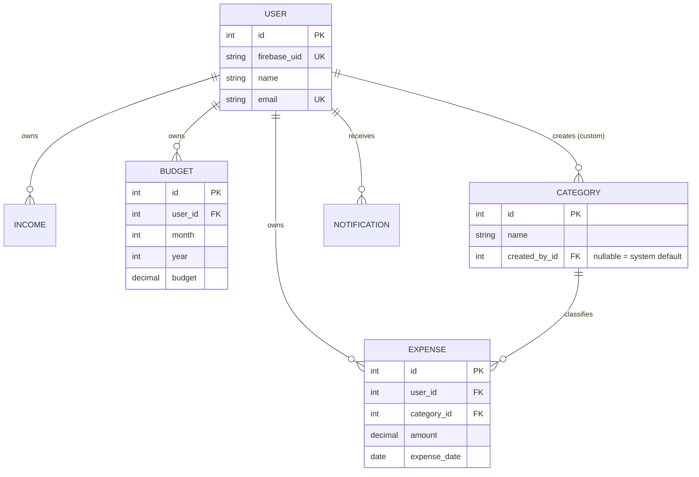
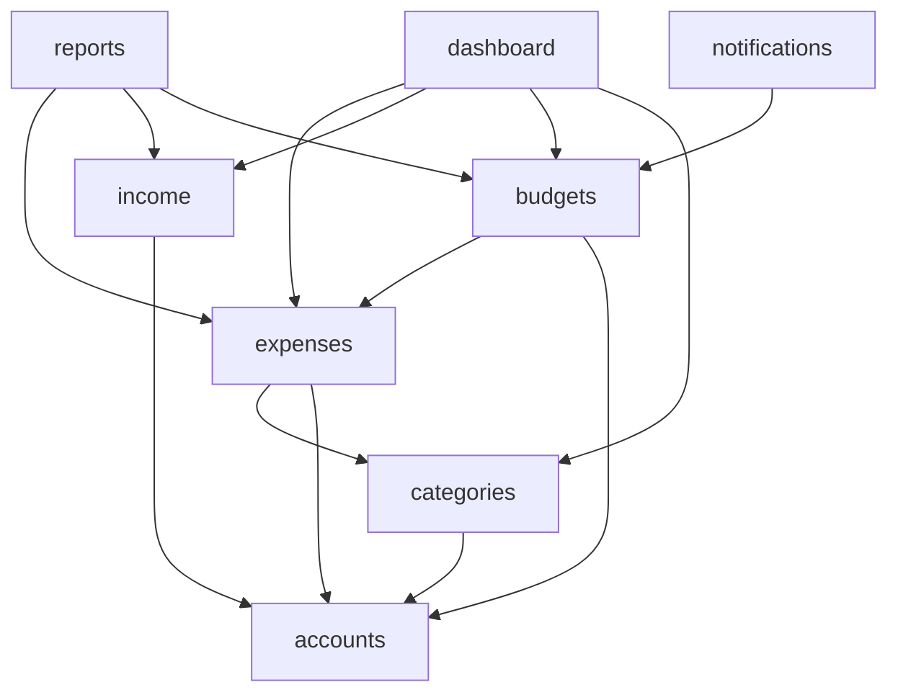

# Expense Tracker Enterprise — Low-Level Design (LLD)

Status: Draft v1.0
Companion doc: [HLD.md](./HLD.md)

This is class-level design: key classes, interfaces/abstract base classes, method signatures, and contracts. Signatures are Python-typed pseudo-code to communicate intent — not final implementation. Detailed DB indexing/migrations are intentionally left to a follow-up database-engineer pass; this covers the shapes needed to design services/repositories correctly.

---

## 1. `common/` — Cross-Cutting Contracts

### 1.1 Exceptions (`common/exceptions/`)

```python
class AppException(Exception):
    """Base for all domain exceptions. Carries a machine-readable code + HTTP status."""
    code: str
    http_status: int
    message: str

class AuthenticationError(AppException): ...      # 401
class PermissionDenied(AppException): ...          # 403
class NotFoundError(AppException): ...             # 404
class ValidationError(AppException): ...           # 400
class DatabaseError(AppException): ...             # 500
```

```python
# common/exceptions/handler.py
def app_exception_handler(exc: Exception, context: dict) -> Response:
    """
    Registered as DRF's EXCEPTION_HANDLER.
    Maps AppException subtypes -> structured {code, message, details} + http_status.
    Unknown exceptions fall through to a generic 500 + ERROR log, never a raw traceback to the client.
    """
```

**SRP/OCP note:** adding a new exception type never touches the handler's dispatch logic — it's a lookup on `type(exc)`, and `AppException` subclasses self-describe their `http_status`.

### 1.2 Permissions (`common/permissions/`)

```python
class IsOwner(BasePermission):
    def has_object_permission(self, request, view, obj) -> bool:
        return obj.user_id == request.user.id
```

Applied on `ExpenseViewSet`, `IncomeViewSet`, `BudgetViewSet`, and custom `CategoryViewSet` entries — in addition to queryset filtering by `request.user`, per HLD's "defense in depth" note.

### 1.3 Repository Base (`common/repositories/base.py`)

```python
T = TypeVar("T", bound=models.Model)

class BaseRepository(ABC, Generic[T]):
    model: Type[T]

    def get_by_id(self, id: int) -> Optional[T]: ...
    def list(self, **filters) -> QuerySet[T]: ...
    def create(self, **data) -> T: ...
    def update(self, instance: T, **data) -> T: ...
    def delete(self, instance: T) -> None: ...
```

Every concrete repository (`ExpenseRepository`, `IncomeRepository`, `BudgetRepository`, `CategoryRepository`, `UserRepository`) extends this. Services depend on `BaseRepository[T]`, never on `Model.objects` directly — this is the Dependency Inversion boundary called out in the HLD.

### 1.4 Service Base (`common/services/base.py`)

```python
class BaseService(ABC):
    def __init__(self, repository: BaseRepository):
        self.repository = repository
```

### 1.5 Validators (`common/validators/`)

```python
def validate_positive_amount(value: Decimal) -> None: ...
def validate_not_future_date(value: date) -> None: ...
def validate_file_size_and_type(file) -> None: ...   # receipts
```

### 1.6 Constants (`common/constants/`)

```python
class PaymentMethod(TextChoices):
    CASH = "cash"
    CARD = "card"
    UPI = "upi"
    NET_BANKING = "net_banking"
    OTHER = "other"

class IncomeSource(TextChoices):
    SALARY = "salary"
    FREELANCING = "freelancing"
    INVESTMENT = "investment"
    BONUS = "bonus"
    OTHER = "other"

class BudgetThreshold(IntEnum):
    WARNING = 80
    HIGH = 90
    EXCEEDED = 100
```

---

## 2. `accounts` — Authentication & User

### 2.1 Auth Abstraction (Adapter pattern)

```python
class AuthProvider(ABC):
    """Interface segregation: only what the app needs from an IDP."""
    def verify_token(self, id_token: str) -> DecodedToken: ...
    def get_claims(self, id_token: str) -> dict: ...

class FirebaseAuthProvider(AuthProvider):
    def verify_token(self, id_token: str) -> DecodedToken:
        # wraps firebase_admin.auth.verify_id_token
        ...
```

### 2.2 DRF Authentication Class

```python
class FirebaseAuthentication(BaseAuthentication):
    def __init__(self, auth_provider: AuthProvider = None, user_repo: UserRepository = None):
        self.auth_provider = auth_provider or FirebaseAuthProvider()
        self.user_repo = user_repo or UserRepository()

    def authenticate(self, request) -> tuple[User, str]:
        token = self._extract_bearer_token(request)
        claims = self.auth_provider.verify_token(token)
        user = self.user_repo.get_or_create_by_firebase_uid(
            firebase_uid=claims["uid"], email=claims["email"]
        )
        return (user, token)
```

**Deviation from the doc's literal "middleware" wording, flagged explicitly:** DRF's idiomatic mechanism for per-request identity resolution is a custom `Authentication` class (wired via `DEFAULT_AUTHENTICATION_CLASSES`), not raw Django middleware — it integrates with `request.user`, DRF permissions, and `drf-spectacular`'s security scheme out of the box. Functionally this *is* the "Firebase → verify token → local user" flow the doc describes; only the Django mechanism used to implement it differs.

### 2.3 Model & Repository

```python
class User(models.Model):
    firebase_uid: str        # unique
    name: str
    email: str                # unique
    photo: str | None
    currency: str = "INR"
    timezone: str = "Asia/Kolkata"
    theme: str = "light"
    created_at: datetime
    updated_at: datetime

class UserRepository(BaseRepository[User]):
    def get_by_firebase_uid(self, uid: str) -> Optional[User]: ...
    def get_or_create_by_firebase_uid(self, firebase_uid: str, email: str) -> User: ...
```

### 2.4 Service

```python
class AccountService(BaseService):
    def get_profile(self, user: User) -> User: ...
    def update_profile(self, user: User, **data) -> User: ...
```

---

## 3. `categories`

```python
class Category(models.Model):
    name: str
    icon: str
    color: str                 # hex
    created_by: User | None    # NULL => system default category
    created_at: datetime

class CategoryRepository(BaseRepository[Category]):
    def list_for_user(self, user: User) -> QuerySet[Category]:
        """Defaults (created_by=None) UNION user's own custom categories."""

class CategoryService(BaseService):
    def create_category(self, user: User, name: str, icon: str, color: str) -> Category:
        # validates uniqueness within (created_by=user, name)
        ...
    def delete_category(self, user: User, category_id: int) -> None:
        # only allowed if created_by == user (defaults are not deletable)
        ...
```

Uniqueness constraint: `UniqueConstraint(fields=["created_by", "name"])` — enforced at DB level, matching HLD risk mitigation.

---

## 4. `expenses`

```python
class Expense(models.Model):
    title: str
    description: str
    amount: Decimal
    category: Category
    payment_method: PaymentMethod
    expense_date: date
    attachment: FileField | None
    notes: str
    user: User                 # "created_by" in the doc's ER sketch
    created_at: datetime
    updated_at: datetime

class ExpenseFilter:
    """Value object carrying search/filter/sort/pagination params — passed through
    View -> Service -> Repository so the repository builds one queryset, not N."""
    search: str | None
    category_id: int | None
    date_from: date | None
    date_to: date | None
    amount_min: Decimal | None
    amount_max: Decimal | None
    payment_method: PaymentMethod | None
    ordering: str = "-expense_date"
    page: int = 1
    page_size: int = 20

class ExpenseRepository(BaseRepository[Expense]):
    def list_filtered(self, user: User, filters: ExpenseFilter) -> QuerySet[Expense]: ...
    def sum_for_period(self, user: User, date_from: date, date_to: date) -> Decimal: ...
    def sum_by_category(self, user: User, date_from: date, date_to: date) -> dict[int, Decimal]: ...

class ExpenseService(BaseService):
    def create_expense(self, user: User, data: dict) -> Expense:
        expense = self.repository.create(user=user, **data)
        BudgetThresholdEvaluator(BudgetService()).evaluate(user, expense.expense_date)  # Observer trigger
        return expense

    def update_expense(self, user: User, expense_id: int, data: dict) -> Expense: ...
    def delete_expense(self, user: User, expense_id: int) -> None: ...
    def get_expense(self, user: User, expense_id: int) -> Expense: ...
    def list_expenses(self, user: User, filters: ExpenseFilter) -> Page[Expense]: ...
    def get_today_total(self, user: User) -> Decimal: ...
    def get_monthly_total(self, user: User, month: int, year: int) -> Decimal: ...
```

---

## 5. `income`

```python
class Income(models.Model):
    source: IncomeSource
    amount: Decimal
    income_date: date
    user: User
    created_at: datetime

class IncomeRepository(BaseRepository[Income]):
    def sum_for_period(self, user: User, date_from: date, date_to: date) -> Decimal: ...

class IncomeService(BaseService):
    def create_income(self, user: User, data: dict) -> Income: ...
    def get_monthly_total(self, user: User, month: int, year: int) -> Decimal: ...
    def calculate_savings(self, user: User, month: int, year: int) -> Decimal:
        """income_total - expense_total for the period (needs ExpenseService — injected, not imported ad hoc)."""
```

---

## 6. `budgets` (Observer subject)

```python
class Budget(models.Model):
    user: User
    month: int
    year: int
    budget: Decimal
    created_at: datetime
    # UniqueConstraint(fields=["user", "month", "year"])

class BudgetRepository(BaseRepository[Budget]):
    def get_for_period(self, user: User, month: int, year: int) -> Optional[Budget]: ...

class BudgetObserver(ABC):
    def on_threshold_crossed(self, user: User, budget: Budget, spent: Decimal, percent: int) -> None: ...

class BudgetService(BaseService):
    _observers: list[BudgetObserver] = []   # registered at app startup (NotificationService, DashboardAlertService)

    def register_observer(self, observer: BudgetObserver) -> None: ...

    def get_status(self, user: User, month: int, year: int) -> BudgetStatus:
        """Returns {budget, spent, remaining, percent_used} — spent computed via ExpenseRepository.sum_for_period."""

    def _notify_if_threshold_crossed(self, user: User, budget: Budget, spent: Decimal) -> None:
        percent = int(spent / budget.budget * 100)
        for threshold in (BudgetThreshold.EXCEEDED, BudgetThreshold.HIGH, BudgetThreshold.WARNING):
            if percent >= threshold:
                for observer in self._observers:
                    observer.on_threshold_crossed(user, budget, spent, percent)
                break   # highest crossed threshold only — idempotent, no duplicate lower-tier alerts
```

`BudgetThresholdEvaluator` (referenced from `ExpenseService.create_expense`) is a thin wrapper that calls `BudgetService.get_status()` then `_notify_if_threshold_crossed()` — kept separate so `ExpenseService` depends on a narrow evaluator interface, not the full `BudgetService`.

---

## 7. `notifications` (Strategy pattern)

```python
class NotificationChannel(ABC):
    """ISP: one method, nothing else forced on implementers."""
    def send(self, user: User, title: str, message: str) -> None: ...

class EmailNotificationChannel(NotificationChannel): ...
class PushNotificationChannel(NotificationChannel): ...
class InAppNotificationChannel(NotificationChannel): ...

class Notification(models.Model):
    user: User
    title: str
    message: str
    kind: str            # "budget_exceeded" | "budget_reminder" | "daily_reminder"
    read: bool = False
    created_at: datetime

class NotificationDispatcher:
    def __init__(self, channels: list[NotificationChannel]):
        self.channels = channels     # e.g. [InAppNotificationChannel(), EmailNotificationChannel()]

    def dispatch(self, user: User, title: str, message: str) -> None:
        for channel in self.channels:
            channel.send(user, title, message)

class NotificationService(BaseService, BudgetObserver):
    def on_threshold_crossed(self, user, budget, spent, percent) -> None:
        title, message = self._compose_budget_message(budget, spent, percent)
        self.dispatcher.dispatch(user, title, message)
        self.repository.create(user=user, title=title, message=message, kind="budget_exceeded")
```

`NotificationService` implementing `BudgetObserver` is what registers with `BudgetService.register_observer()` — this is the concrete Observer wiring: budgets don't import notifications, notifications subscribe to budgets.

---

## 8. `reports` (Strategy + Factory)

```python
class ReportPeriodStrategy(ABC):
    def get_range(self, reference_date: date) -> tuple[date, date]: ...

class DailyReportStrategy(ReportPeriodStrategy): ...
class WeeklyReportStrategy(ReportPeriodStrategy): ...
class MonthlyReportStrategy(ReportPeriodStrategy): ...
class YearlyReportStrategy(ReportPeriodStrategy): ...

REPORT_STRATEGIES: dict[str, ReportPeriodStrategy] = {
    "daily": DailyReportStrategy(),
    "weekly": WeeklyReportStrategy(),
    "monthly": MonthlyReportStrategy(),
    "yearly": YearlyReportStrategy(),
}

@dataclass
class ReportData:
    date_from: date
    date_to: date
    total_income: Decimal
    total_expense: Decimal
    by_category: dict[str, Decimal]
    transactions: list[Expense]

class ReportService(BaseService):
    def generate(self, user: User, period: str, reference_date: date) -> ReportData:
        strategy = REPORT_STRATEGIES[period]              # Strategy
        date_from, date_to = strategy.get_range(reference_date)
        ...

class IReportExporter(ABC):
    def export(self, data: ReportData) -> HttpResponse: ...

class CSVReportExporter(IReportExporter): ...
class ExcelReportExporter(IReportExporter): ...
class PDFReportExporter(IReportExporter): ...

class ReportExporterFactory:
    _registry: dict[str, Type[IReportExporter]] = {
        "csv": CSVReportExporter,
        "excel": ExcelReportExporter,
        "pdf": PDFReportExporter,
    }

    @classmethod
    def get_exporter(cls, format: str) -> IReportExporter:
        if format not in cls._registry:
            raise ValidationError(f"Unsupported export format: {format}")
        return cls._registry[format]()
```

**OCP in action:** adding a 4th export format = one new class + one registry entry. No existing exporter, service, or view changes.

---

## 9. `dashboard` (Facade — no models)

```python
class DashboardService:
    def __init__(self, expense_service: ExpenseService, income_service: IncomeService,
                 budget_service: BudgetService, category_service: CategoryService):
        ...

    def get_summary(self, user: User) -> DashboardSummary:
        """Aggregates: today's expense, monthly expense/income, remaining budget,
        category count, recent transactions, upcoming budget alerts, chart series."""
```

---

## 10. Entity Relationships (conceptual — indexing/migrations owned by a follow-up DB-design pass)



---

## 11. Module Dependency Graph (import direction — enforced by convention/lint, not just documentation)



No arrow ever points back into `dashboard`, `reports`, or `notifications` — they are the only "aggregator" layers; domain modules stay ignorant of them, which is what keeps `expenses`/`budgets`/`income`/`categories` independently testable and reusable.

## Recommended Next Steps

Same as HLD §Recommended Next Steps — this document is the class-level companion, not a separate workstream.
